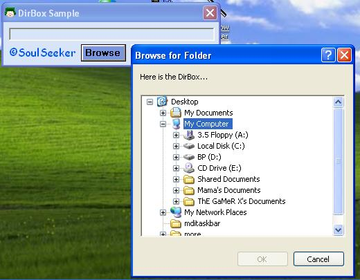



## DirBox Sample

### Description

It is the same as the Common Dialog Control,when you use it for openning/saving files,but it is working with directories not with files.This is my first code on PSC.Pls send some feedback!
 
### More Info
 

             |
---                |---
**Submitted On**   |2002-04-02 22:42:32
**By**             |[Ivan Zlatev](https://github.com/Planet-Source-Code/PSCIndex/blob/master/ByAuthor/ivan-zlatev.md)
**Level**          |Beginner
**User Rating**    |4.4 (22 globes from 5 users)
**Compatibility**  |VB 6\.0
**Category**       |[Files/ File Controls/ Input/ Output](https://github.com/Planet-Source-Code/PSCIndex/blob/master/ByCategory/files-file-controls-input-output__1-3.md)
**World**          |[Visual Basic](https://github.com/Planet-Source-Code/PSCIndex/blob/master/ByWorld/visual-basic.md)
**Archive File**   |[DirBox\_Sam714194122002\.zip](https://github.com/Planet-Source-Code/ivan-zlatev-dirbox-sample__1-33741/archive/master.zip)

